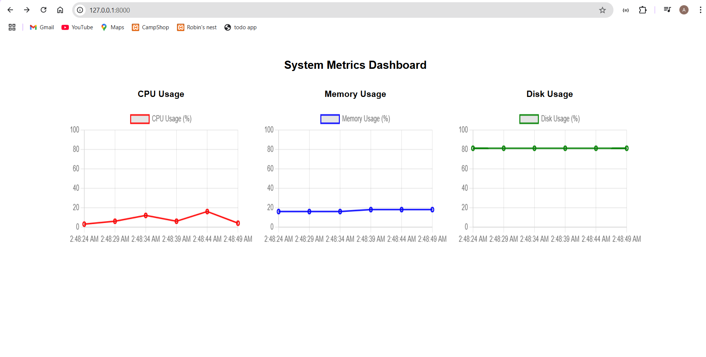

# System Health Monitoring & Alerting Tool

## Overview
This tool monitors system health by tracking **CPU usage, memory usage, and disk usage**. It provides API endpoints to fetch system metrics, assign metadata, and trigger alerts when thresholds are exceeded.

## Dashboard Preview


## Features
- **Real-time System Metrics**: CPU, Memory, Disk Usage
- **Metadata Assignment**: Store server details
- **Alerts**: Trigger alerts for high CPU usage (>80%) and low disk space (<10%)
- **Historical Data**: Store all metrics in a database
- **RESTful API**: Expose API endpoints for metrics, alerts, and metadata

---
## Prerequisites
Ensure you have the following installed:
- PHP 8.x
- Laravel 10.x
- MySQL
- Composer
- Postman (for API testing, optional)

---
## Installation

### 1. Clone the Repository
```sh
git clone https://github.com/Ankita5051/System-heath-monitoring.git
cd System-heath-monitoring
```

### 2. Install Dependencies
```sh
composer install
```

### 3. Configure Environment Variables
Copy the `.env.example` file and set up your database connection.
```sh
cp .env.example .env
```
Edit the `.env` file:
```env
DB_CONNECTION=mysql
DB_HOST=127.0.0.1
DB_PORT=3306
DB_DATABASE=your_database_name
DB_USERNAME=your_db_user
DB_PASSWORD=your_db_password
```

### 4. Run Migrations
```sh
php artisan migrate
```

### 5. Start the Laravel Server
```sh
php artisan serve
```

---
## API Endpoints

### **1. Fetch System Metrics**
```http
GET /api/metrics
```
**Response:**
```json
{
"cpu":"14%",
"memory":"20MB",
"disk":"81.37% Used",
"timestamp":"2025-02-14T19:50:24.919319Z"
}
```

### **2. Fetch Historical Metrics**
```http
GET /api/metrics/history
```
**Response:**
```json
[
{"id":8,"cpu_usage":16,"memory_usage":20,"disk_usage":81.46,"created_at":"2025-02-14 17:56:47"},{"id":7,"cpu_usage":13,"memory_usage":20,"disk_usage":81.46,"created_at":"2025-02-14 17:56:44"},{"id":6,"cpu_usage":19,"memory_usage":20,"disk_usage":81.46,"created_at":"2025-02-14 17:56:37"},{"id":5,"cpu_usage":6,"memory_usage":20,"disk_usage":81.46,"created_at":"2025-02-14 17:55:37"},{"id":4,"cpu_usage":5,"memory_usage":20,"disk_usage":81.46,"created_at":"2025-02-14 17:54:37"},{"id":3,"cpu_usage":14,"memory_usage":20,"disk_usage":81.46,"created_at":"2025-02-14 17:53:37"},{"id":2,"cpu_usage":3,"memory_usage":20,"disk_usage":81.46,"created_at":"2025-02-14 17:53:13"},{"id":1,"cpu_usage":13,"memory_usage":20,"disk_usage":81.46,"created_at":"2025-02-14 17:52:37"}
]

```

### **2. Fetch Historical Metrics**
```http
GET /api/metadata
```
**Response:**
```json

[
{
"id":1,
"server_name":"Server -A",
"environment":"Production",
"location":"India",
"created_at":"2025-02-14 20:01:03",
"updated_at":"2025-02-14 20:01:03"
}
]

```

### **3. Set Metadata**
```http
POST /api/metadata
```
**Request Body:**
```json
{
    "server_name": "Server-A",
    "environment": "Production",
    "location": "India"
}
```
**Response:**
```json
{
"message":"Metadata saved",
"data":{
"server_name":"Server -A",
"environment":"Production",
"location":"India",
"updated_at":"2025-02-14T19:58:12.000000Z",
"created_at":"2025-02-14T19:58:12.000000Z",
"id":1
}
}

```

### **4. Fetch Alerts**
```http
GET /api/alerts
```
**Response:**
```json
[
{"id":1,"metric":"CPU","value":21,"threshold":"80%","status":"active","created_at":"2025-02-14 19:54:47","updated_at":null},{"id":2,"metric":"CPU","value":21,"threshold":"80%","status":"active","created_at":"2025-02-14 19:54:50","updated_at":null},{"id":3,"metric":"CPU","value":34,"threshold":"80%","status":"active","created_at":"2025-02-14 19:54:55","updated_at":null}
]

```

---
## Running Tests
Run unit tests using:
```sh
php artisan test
```

---
## Deployment
For cloud deployment, use **Railway, Render, or AWS**.
```sh
git add .
git commit -m "Initial commit"
git push origin main
```

---
## Troubleshooting
### 1. **Migrations Fail?**
Run:
```sh
php artisan migrate:fresh --seed
```

### 2. **Error: Permission Denied on Storage?**
Run:
```sh
chmod -R 775 storage bootstrap/cache
```

### 3. **API Returns 404?**
Check routes:
```sh
php artisan route:list
```

---
## Credits
Developed by **Ankita5051**

If you found this project helpful, give it a ⭐ on GitHub!

---

